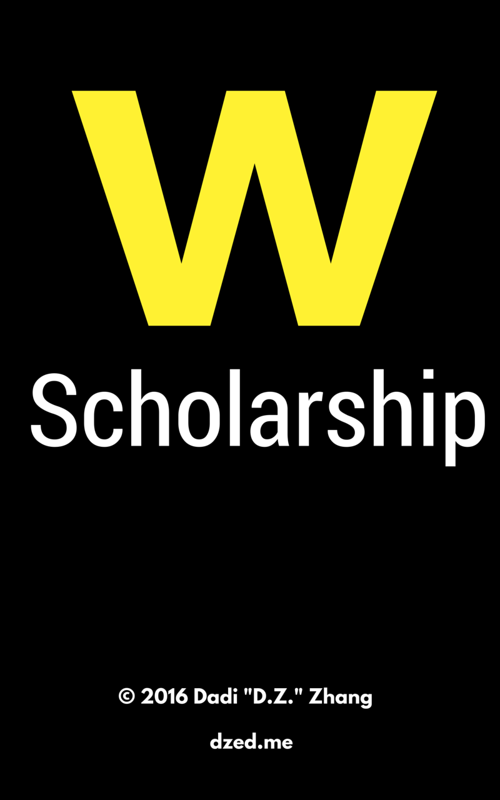

# WatScholarship

Get it on [Google Play](https://play.google.com/store/apps/details?id=me.dzed.uwscholarshipfinder&hl=en)

This is a simple application that helps University of Waterloo students search for scholarship information via the UW API. Gain access to all the academic scholarships offered by the University of Waterloo and its sponsors!

Clean and concise list of scholarships. Click on each for more details regarding application deadlines and eligibility! WatScholarship uses the official University of Waterloo data. This means the information is always accurate and updated.

Note: This application is not affiliated with the University of Waterloo in any way.

Check out my personal website: http://dzed.me for more cool stuff, including a Go tutorial, a blog, and much more!

Last Updated May 6, 2016

© Dadi Zhang 2016